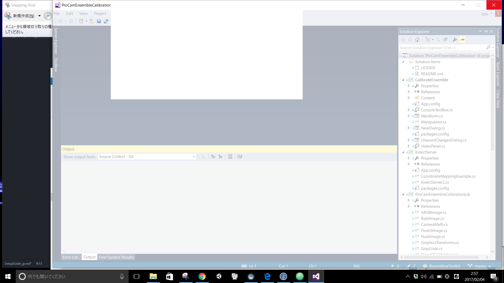

# 用意するもの
- Visual Studio 2015
- [Windows SDK 8.1](https://developer.microsoft.com/ja-jp/windows/downloads/windows-8-1-sdk)

これらをインストール

# 最初にサービス登録
- files/ 以下の batとregファイルをダブルクリックで実行
- slnを開いてビルド (x64 release build)
  
- Shaders以下は個別にシェーダー種別を指定してctrl+F7でscoファイルを生成しておく
